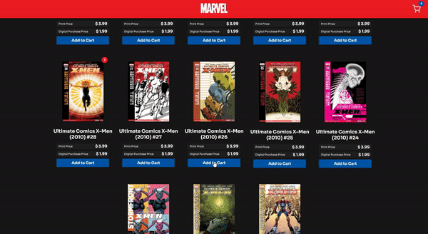

# HQ Store

A Marvel inspired HQ Store using Marvel's API, React.js and Redux.

  

## [Live demo here](https://lnardon-hqstore.web.app/ "Homepage")

### Installation

- Clone the repository, run `yarn && yarn start` on the react folder, and it will be available for you on your localhost.
- On the root folder create a `.env` file with the folowing content: `REACT_APP_API_KEY=<YOUR_MARVEL_API_KEY_HERE>`

### What I Used on this project

- React
- React Hooks
- Redux
- Redux Hooks
- Marvel API
